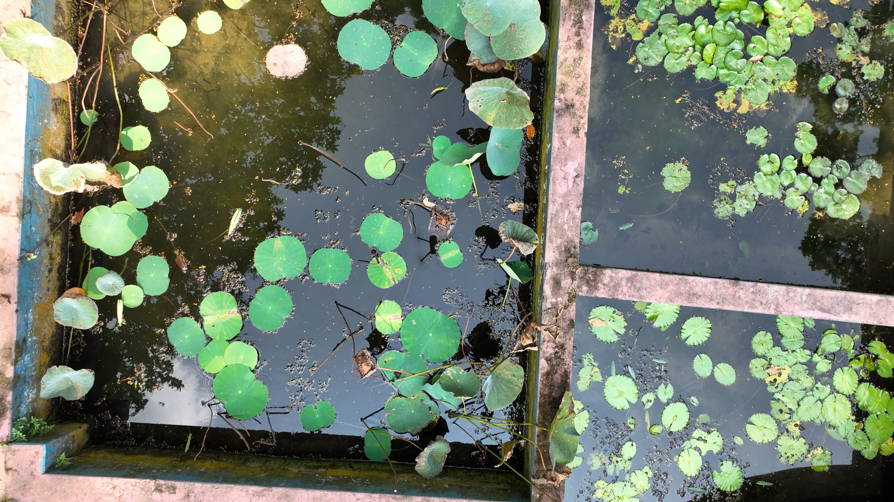
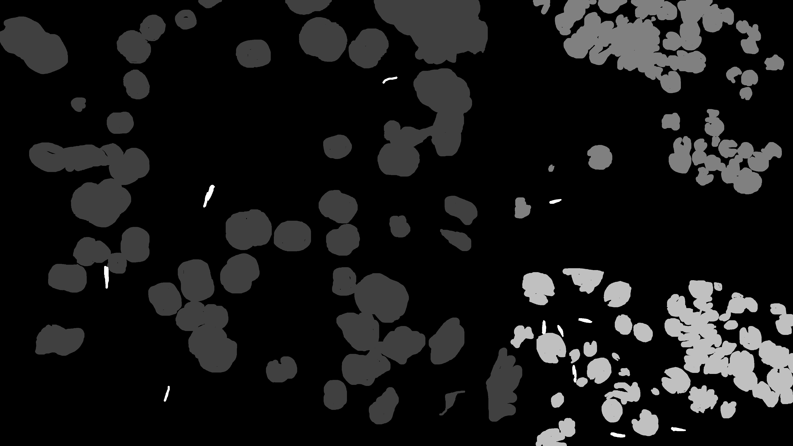

# Multiclass-Semantic-Segmentation-Annotation with tool-usage-codes
Main image to be annotated is:


The annotated image (grayscale 1 channel) for separate classes:


# Installation
   ```bash
   conda install -c anaconda pillow
   conda install -c anaconda opencv
   conda install -c anaconda matplotlib
   conda install anaconda::scikit-image
   conda install anaconda::pandas
   ``` 


# Step by step guideline
* First, download the Fiji [software](https://imagej.net/software/fiji/?fbclid=IwAR26ajriJbLHJcDIoJU3g8RfrWojjTbk_Y72_qy8oqHdZ2wk9__TdMWOqDA) for annotating for semantic segmentation.
* Secondly, unzip and open the tool from ImageJ-win64.exe.
* Then follow: File (tab) > Open > desired_image > Plugins (tab) > Labkit > Open Current Image with Labkit
* Later, use **Draw, Flood fill, Erase** to draw masks for desired classes. To add more classes, click 'Add Label' button. Complete drawing mask accordingly for each classes. Don't forget to add background (can use Flood fill) at the end as a class.
* For each class, click the 'Export as Bitmap..' button to save the binary semantic segmentation mask image (in .tif format) for each class.
* Save all the binary mask for each class like previous step.
* Lastly, run the python code (Multiclass semantic segmentation annotation.ipynb) to make a multiclass semantic segmentation mask in grayscale. Make sure to change the name of binary mask files and the desired label of each class in the python code.
